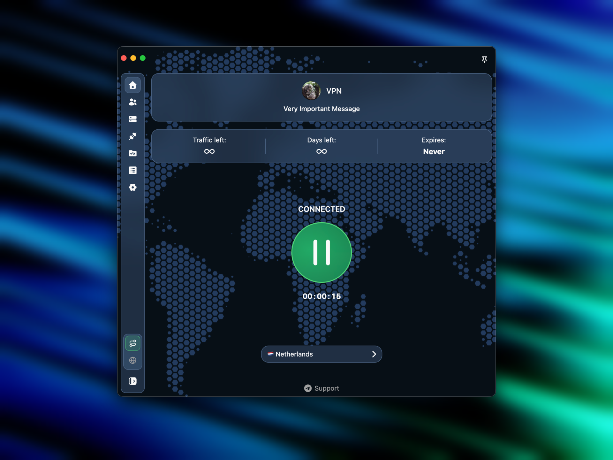

import { CardGrid, LinkCard } from '@astrojs/starlight/components';

Koala Clash is a desktop client for the [Mihomo](https://github.com/MetaCubeX/mihomo) (Clash Meta) core
on Windows, macOS and Linux. Add a subscription from your provider, press one button, and your traffic
goes through the proxy according to the subscription's rules.

## Features

- **One-button connection** — through a virtual network interface (TUN) or the system proxy.
- **Subscription on the home screen** — traffic left, days left, expiry date, provider announcements
  and a support link.
- **One-click import** — with a button on the provider's website, a link from the clipboard or a file.
- **Your own routing rules** on top of the subscription — they survive subscription updates.
- **Built-in Mihomo cores** — stable and preview.
- **Tray, floating window and shortcuts** — switch things without opening the main window.
- **Themes**, including a theme sent by the provider with the subscription.
- **Interface** in English, Russian and Chinese.

Koala Clash is based on [Sparkle](https://github.com/xishang0128/sparkle).

## Where to start

<CardGrid>
	<LinkCard title="Installation" href="../installation/" description="Which file to download for your system." />
	<LinkCard title="Adding a subscription" href="../../usage/subscriptions/" description="Import the link from your provider." />
	<LinkCard title="Connecting" href="../../usage/connecting/" description="Home screen, TUN and the system proxy." />
	<LinkCard title="For providers" href="../../providers/headers/" description="Subscription headers and import links." />
</CardGrid>
